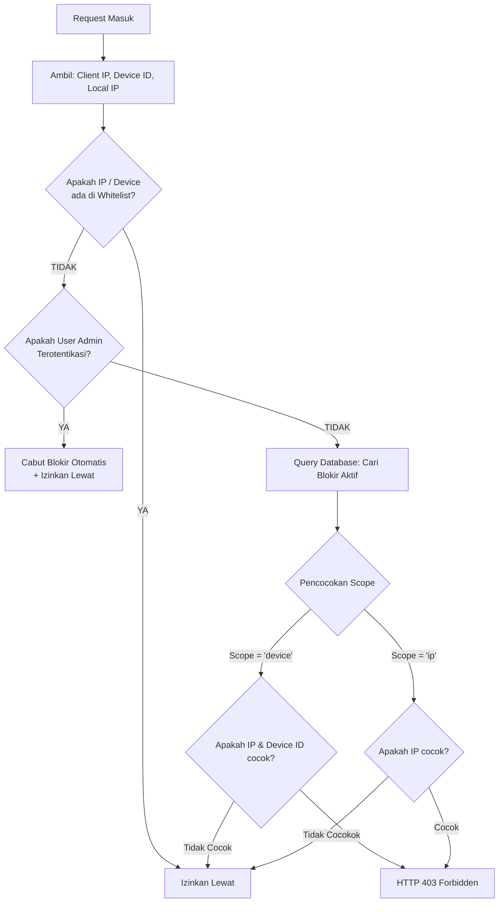

Salah satu kelemahan terbesar sistem WAF dan fail2ban tradisional adalah ketergantungan mutlak pada alamat IP publik. Dalam ekosistem modern di mana NAT (Network Address Translation) digunakan secara masif di perkantoran, universitas, mall, dan jaringan seluler (CGNAT), pemblokiran berbasis IP publik membawa risiko tinggi.

---

## 1. Masalah IP Bersama (Shared NAT Problem)

Bayangkan skenario berikut:
- Sebuah kantor dinas memiliki 300 staf yang bekerja menggunakan satu router internet bersama dengan IP publik `103.11.22.33`.
- Salah satu komputer staf terinfeksi malware atau seorang pengguna nakal mencoba melakukan scanning kerentanan (`sqlmap`).
- WAF konvensional mendeteksi serangan dari IP `103.11.22.33` dan memblokirnya.
- **Dampak Fatal**: 299 staf lainnya yang sedang melayani masyarakat tiba-tiba terputus dari sistem (*collateral damage*).

---

## 2. Solusi: Isolasi Tingkat Perangkat

**`robyajo/laravel-security-monitor`** memecahkan masalah ini dengan memperkenalkan konsep **Device-Level Quarantine**.

Selain alamat IP publik, sistem mengekstrak dua penanda unik perangkat:
1. **`device_id`**: Fingerprint perangkat unik (berbasis WebRTC candidate hash, persistent cookie UUID, atau header `X-Device-Id`).
2. **`local_ip`**: Alamat IP lokal pada jaringan LAN (misal: `192.168.1.45`), diperoleh dari header `X-Local-Ip` atau sesi klien.

### Cara Pengiriman Header oleh Klien / Frontend:
Aplikasi frontend (React, Vue, mobile app, atau script Blade) dapat menyertakan header berikut pada setiap panggilan AJAX/Fetch:

```javascript
fetch('/api/data', {
    headers: {
        'X-Device-Id': getOrCreatePersistentDeviceId(), // UUID v4 atau WebRTC fingerprint
        'X-Local-Ip': getLocalIpAddress(),             // mis. '192.168.1.105'
    }
});
```

---

## 3. Cakupan Pemblokiran (`block_scope`)

Di tabel `blocked_ips`, kolom `block_scope` menentukan ruang lingkup blokir:

### A. `block_scope = 'device'` (Karantina Perangkat Saja)
- Blokir **hanya berlaku** jika request datang dari `ip_address` yang sama **DAN** memiliki `device_id` yang sama.
- Pengguna lain pada IP publik yang sama (dengan `device_id` berbeda atau tanpa `device_id`) **tetap diizinkan masuk tanpa hambatan**.
- Ini adalah pilihan terbaik untuk mengisolasi pelaku penyerangan di kantor atau jaringan Wi-Fi publik.

### B. `block_scope = 'ip'` (Blokir Seluruh Jaringan/IP)
- Berlaku untuk serangan berskala masif, distributed botnet, atau penyerang dari IP server VPS/proxy publik (misal DigitalOcean, Linode) yang terbukti tidak memiliki pengguna sah.
- Seluruh request dari IP publik tersebut langsung ditolak.

---

## 4. Hirarki Evaluasi pada Middleware `BlockIpAddress`

Saat request masuk, middleware `BlockIpAddress` mengevaluasi blokir dengan alur bertingkat:



---

## 5. Buka Blokir Perangkat Spesifik

Ketika seorang pengguna yang terisolasi mengajukan tiket permohonan buka blokir, tiket tersebut secara otomatis mencatat `device_id` dan `local_ip` miliknya. 

Saat administrator menyetujui tiket melalui REST API `/api/security/unblock-tickets/{id}/respond`, fungsi `SecurityMonitorService::unblockIp($ip, $deviceId)` hanya akan mencabut status blokir milik perangkat tersebut, menjaga status keamanan perangkat lain jika ada.
