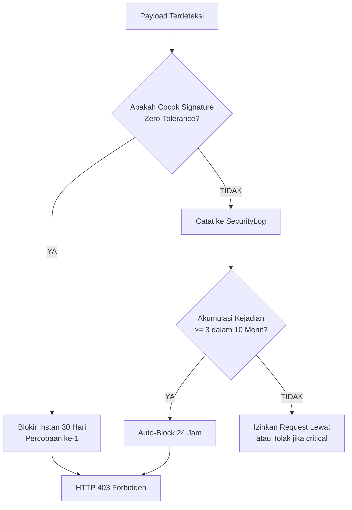

Mesin deteksi ancaman (`SecurityMonitorService::inspect()`) adalah jantung dari Web Application Firewall (WAF) mandiri di dalam paket ini. Mesin ini bertugas menganalisis seluruh lalu lintas HTTP yang masuk dan menentukan apakah suatu request bersifat berbahaya, mencurigakan, atau sah.

---

## 1. Target Inspeksi HTTP Request

Setiap request diuraikan ke dalam beberapa area inspeksi spesifik (`target`):

1. **`path`**: URI path request (misal: `/admin/../../../etc/passwd` atau `/wso.php`).
2. **`query`**: String parameter query URL mentah (misal: `?id=1%20UNION%20SELECT`).
3. **`body`**: Payload mentah body request (JSON, form-urlencoded, multipart raw stream).
4. **`input`**: Kombinasi seluruh parameter query dan form input yang telah di-decode oleh Laravel.
5. **`filename`**: Nama berkas yang diunggah melalui formulir (`$request->allFiles()`).
6. **`user_agent`**: String identifikasi browser/klien (`User-Agent` HTTP header).
7. **`any`**: Seluruh target di atas digabungkan menjadi satu kesatuan inspeksi.

> **Proteksi Batas Ukuran (`max_inspect_length`)**: Untuk mencegah serangan DoS berbasis konsumsi memori, teks yang diinspeksi dibatasi sepanjang maksimal `SECURITY_MAX_INSPECT_LENGTH` (default: 4000 karakter). Jika ukuran body melebihi batas ini, pemotongan dilakukan secara aman tanpa merusak keabsahan regex.

---

## 2. Zero-Tolerance Instant Block vs Auto-Block

Paket membagi respons ancaman menjadi dua mekanisme berbeda:

### A. Zero-Tolerance Instant Block (Blokir Instan)
Sebagian payload serangan **tidak pernah muncul dalam lalu lintas manusia normal**. Sebagai contoh:
- Mengunggah berkas bernama `avatar.php%00.jpg` (null byte attack).
- Mengunggah berkas bernama `shell.php.png` (double extension).
- Melakukan path traversal ke webroot: `../../../../public/index.php`.
- Membuka berkas konfigurasi rahasia: `/.env`, `/.git/config`, `/.htaccess`.
- Menyuntikkan canary Server-Side Template Injection (SSTI): `{{7*7}}` atau `${7*7}`.
- Memindai dengan User-Agent pemindai kerentanan: `sqlmap`, `nikto`, `acunetix`, `nmap`.

> **Aturan**: Pelaku yang mengirim salah satu dari signature di atas **LANGSUNG DIBLOKIR PADA REQUEST PERTAMA** selama 720 jam (30 hari) tanpa perlu menunggu akumulasi ambang batas!

### B. Progressive Threat Score & Sliding Window (Auto-Block)
Serangan lain seperti dugaan SQL Injection samar (`' or 1=1--`), pola XSS (`<script>`), atau path scanning biasa bisa saja terjadi akibat kesalahan ketik atau input data pengguna yang valid.

Oleh karena itu, pola-pola ini dimasukkan ke dalam mekanisme **Progressive Sliding Window**:
1. Setiap kali terjadi ancaman berlevel `high` atau `critical`, catatan disimpan di tabel `security_logs`.
2. Sistem memeriksa berapa kali IP/perangkat tersebut memicu ancaman dalam kurun waktu `window_minutes` (default: 10 menit).
3. Jika jumlah kejadian mencapai `threshold` (default: 3 kali), IP/perangkat secara otomatis diblokir selama `duration_hours` (default: 24 jam).

---

## 3. Tingkat Bahaya Ancaman (Threat Levels)

Setiap aturan diklasifikasikan ke dalam 4 tingkatan:

| Level | Deskripsi | Contoh Skenario | Aksi Bawaan |
| :--- | :--- | :--- | :--- |
| **`critical`** | Serangan fatal yang mengancam integritas server atau data | SQLi `UNION SELECT`, Remote Code Execution, SSTI, Null Byte | Hitung untuk auto-block; jika `block_suspicious_requests=true` langsung tolak. |
| **`high`** | Percobaan eksploitasi aktif terarah | XSS tersimpan, Path traversal `../`, probe `.git/config` | Hitung untuk auto-block. |
| **`medium`** | Anomali input atau encoding yang tidak wajar | Encoding berlapis, double URL-decode, tag HTML mencurigakan | Dicatat ke log audit. |
| **`low`** | Scanner informasi umum atau probe pasif | Akses ke rute admin yang tidak ada, bot user-agent umum | Dicatat untuk analisis statistik. |

---

## 4. Standar Keamanan ReDoS (Regular Expression Denial of Service)

ReDoS adalah serangan di mana penyerang mengirimkan string tertentu yang memicu algoritma regex engine untuk melakukan komputasi eksponensial (Catastrophic Backtracking), membekukan proses PHP-FPM dan membuat server CPU melonjak hingga 100%.

### Aturan Baku Pembuatan Signature di Paket Ini:
1. **Dilarang Menggunakan Kuantifier Bersarang**:
   - ❌ `(a+)+` atau `([a-zA-Z0-9]+)*` atau `(.*[a-z])+`
   - ✅ Gunakan karakter set eksplisit dengan batasan: `[a-zA-Z0-9_]{1,100}`
2. **Gunakan Atomic Grouping atau Non-Backtracking Quantifiers**:
   - Gunakan `(?:pattern)` dengan batas awal dan akhir yang jelas.
3. **Uji Beban Wajib (`DetectorTuningTest`)**:
   - Seluruh regex wajib diuji terhadap string acak sepanjang 100KB+ untuk memastikan waktu eksekusi berada di bawah 1 milidetik.
