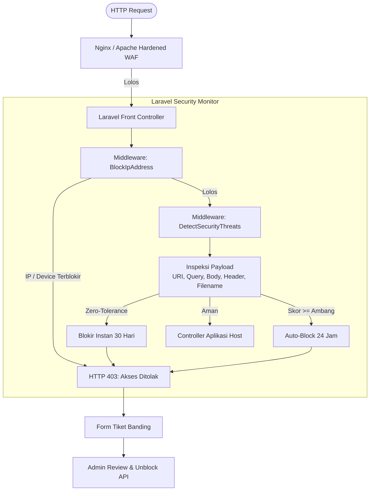

import {
  Card,
  CardGrid,
  LinkCard,
  Steps,
  Tabs,
  TabItem,
} from "@astrojs/starlight/components";
import pkg from "../../data/package.json";

Paket **`robyajo/laravel-security-monitor`** (Bulwark) adalah Web Application Firewall
(WAF) mandiri untuk Laravel yang mengikuti standar paket Spatie: **100% murni PHP**,
tanpa dependensi NPM/Node, dan tanpa memaksakan satu jenis frontend.

<p>
  <strong>Versi terbaru:</strong> v{pkg.packagist.version}
  {" · "}
  <a href={pkg.packagist.url} target="_blank" rel="noopener">
    Packagist
  </a>
  {" · "}
  <a href="changelog/">Changelog</a>
  {" · "}
  <a href={pkg.repository} target="_blank" rel="noopener">
    GitHub
  </a>
</p>

## Fitur Utama

<CardGrid>
  <Card title="Zero-Tolerance WAF" icon="puzzle">
    Blokir instan pada request pertama untuk signature berbahaya: null byte,
    double extension, path traversal, webshell, dan SSTI.
  </Card>
  <Card title="Karantina Perangkat" icon="laptop">
    Isolasi penyerang pada IP publik bersama (NAT) tanpa memblokir seluruh
    kantor.
  </Card>
  <Card title="Login Bertingkat" icon="setting">
    Lockout eksponensial 1 menit, 5 menit, 15 menit, 1 jam, sampai 24 jam untuk
    melawan brute force dan credential stuffing.
  </Card>
  <Card title="Dashboard Vanilla CSS" icon="star">
    Starter kit monitoring responsif untuk Blade (Livewire) & React (Inertia) dengan
    Pure Vanilla CSS tanpa dependensi UI eksternal.
  </Card>
  <Card title="Pemindai Webshell" icon="magnifier">
    Baseline SHA-256 berkas inti dan deteksi berkas mencurigakan di server.
  </Card>
  <Card title="REST API Headless" icon="rocket">
    Endpoint JSON murni, siap dikonsumsi React, Vue, Livewire, atau aplikasi
    mobile.
  </Card>
</CardGrid>

## Mulai dalam 3 Langkah

<Steps>

1. Pasang paket melalui Composer.

   ```bash
   composer require robyajo/laravel-security-monitor
   ```

2. Publikasikan konfigurasi, migrasi, dashboard, dan template web server sekaligus.

   ```bash
   php artisan security:install
   ```

3. Jalankan migrasi database.

   ```bash
   php artisan migrate
   ```

</Steps>

Perintah `security:install` secara otomatis menyuntikkan trait `HasSecurityRelations` pada model `User`
dan mendaftarkan middleware WAF ke bootstrap aplikasi host Anda (`bootstrap/app.php` atau `Kernel.php`).
Detail lengkapnya ada di [Panduan Instalasi](getting-started/installation/).

## Alur Arsitektur



## Jelajahi Dokumentasi

<CardGrid>
  <LinkCard title="Memulai" href="getting-started/introduction/">
    Latar belakang, instalasi, dan seluruh variabel konfigurasi.
  </LinkCard>
  <LinkCard
    title="Arsitektur Inti"
    href="core-architecture/threat-detection-engine/"
  >
    Mesin deteksi, karantina perangkat, dan resolusi reverse proxy.
  </LinkCard>
  <LinkCard
    title="Modul Keamanan"
    href="security-modules/stepped-login-throttling/"
  >
    Login lockout, pemindai webshell, dan tiket banding.
  </LinkCard>
  <LinkCard title="Referensi REST API" href="api-reference/api-overview/">
    Konvensi, endpoint publik, pengguna, dan administrator.
  </LinkCard>
  <LinkCard title="CLI & Otomasi" href="cli-automation/artisan-commands/">
    Perintah Artisan dan tugas terjadwal.
  </LinkCard>
  <LinkCard
    title="Hardening Web Server"
    href="webserver-hardening/nginx-hardened-waf/"
  >
    Konfigurasi Nginx, Apache, dan checklist produksi.
  </LinkCard>
  <LinkCard title="Changelog" href="changelog/">
    Riwayat lengkap perubahan dan rilis paket.
  </LinkCard>
  <LinkCard
    title={`Packagist v${pkg.packagist.version}`}
    href={pkg.packagist.url}
  >
    Halaman paket resmi di Packagist.
  </LinkCard>
</CardGrid>

## Kompatibilitas

<Tabs>
  <TabItem label="PHP">`^8.2`, `^8.3`, `^8.4`, `^8.5`</TabItem>
  <TabItem label="Laravel">`^10.0`, `^11.0`, `^12.0`, `^13.0`</TabItem>
  <TabItem label="Ekstensi">
    `pdo`, `mbstring`, `json`, `filter`, `openssl` — tanpa `gd` atau `imagick`.
  </TabItem>
</Tabs>

> ℹ️ Dokumentasi ini juga tersedia sebagai portal HTML statis di folder
> `documents/` pada repositori paket. Situs Astro ini adalah versi utama yang
> lebih cepat, dapat dicari, dan siap dideploy.
