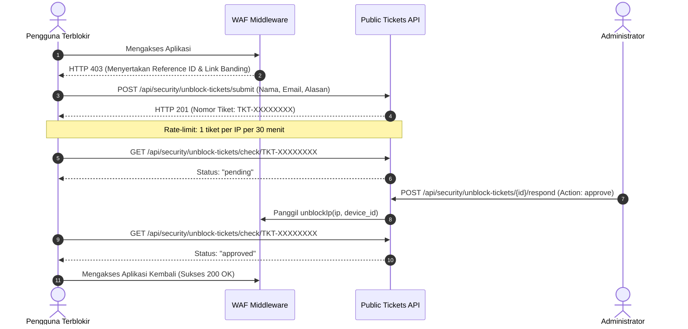

Dalam sistem keamanan otomatis, pemblokiran yang keliru (*false positive*) dapat terjadi, misalnya seorang staf salah mengetikkan simbol kode pada form input atau perangkat terinfeksi adware tanpa disadari.

Jika sistem tidak memiliki jalur komunikasi mandiri, pengguna yang terblokir akan kesulitan menghubungi tim IT. Paket ini menyertakan subsistem **Tiket Banding (Appeal Tickets)** mandiri.

---

## 1. Alur Pengajuan Tiket oleh Pengguna



---

## 2. Fitur Proteksi Tiket Banding

Untuk mencegah formulir banding dijadikan sasaran spam atau DoS oleh bot penyerang:

1. **Pengecualian Rute Autentikasi (`isAuthRoute`)**:
   - Rute `/security/unblock-tickets/submit` dan `/security/unblock-tickets/check/*` dikecualikan secara khusus dari pemblokiran middleware `BlockIpAddress` sehingga pengguna yang terblokir tetap dapat mengirim tiket.
2. **Rate Limiting Ketat (Cooldown Period)**:
   - Satu alamat IP hanya diperbolehkan mengajukan **maksimal 1 tiket per 30 menit**. Pengajuan tiket baru saat tiket sebelumnya masih berstatus `pending` akan langsung ditolak dengan **HTTP 429 Too Many Requests**.
3. **Pencatatan Metadata Lengkap**:
   - Tiket secara otomatis mengikat `ip_address`, `device_id`, `local_ip`, `user_agent`, dan `blocked_ip_id` yang sedang aktif.

---

## 3. Alur Kerja Administrator

Administrator dapat mengelola tiket melalui panel admin atau API REST:

1. **Melihat Antrean Tiket**:
   `GET /api/security/unblock-tickets?status=pending`
2. **Menyetujui Permohonan (Approve)**:
   `POST /api/security/unblock-tickets/{id}/respond` dengan body:
   ```json
   {
       "action": "approve",
       "admin_notes": "Identitas staf terverifikasi, membuka blokir perangkat."
   }
   ```
   **Otomasi Sistem**:
   - Status tiket berubah menjadi `approved`.
   - Kolom `resolved_by` diisi ID administrator dan `resolved_at` dicatat.
   - Sistem **secara otomatis memanggil `SecurityMonitorService::unblockIp()`** untuk mencabut blokir pada IP/perangkat yang bersangkutan tanpa perlu tindakan manual tambahan.
3. **Menolak Permohonan (Reject)**:
   Body dengan `"action": "reject"` dan catatan penolakan. Blokir tetap aktif.
